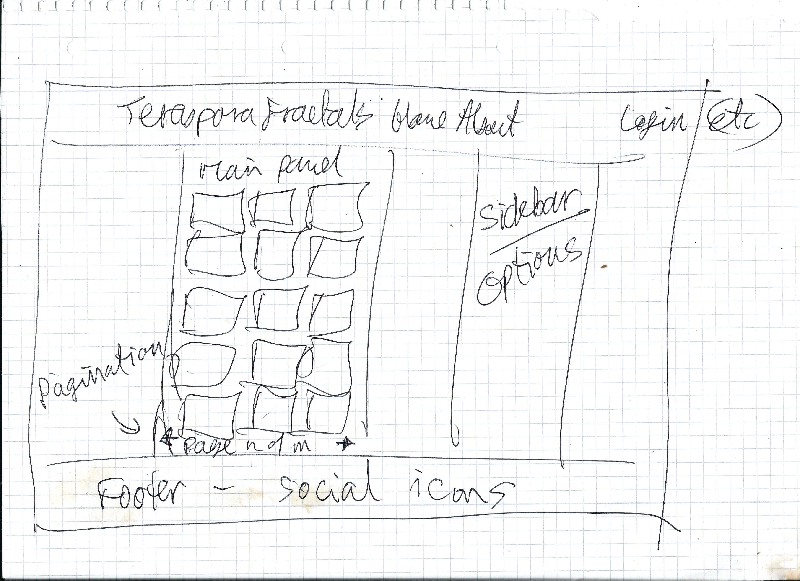
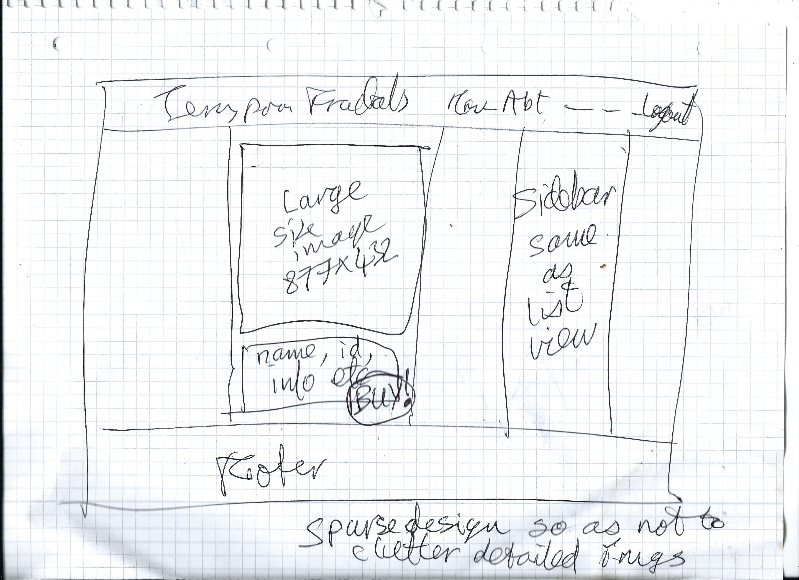

# Trif

## Project deployed to [ztrif.herokuapp.com][15].

## Overview

Trif is a web application which classifies and offers for sale high-definition prints of abstract fractal images created in Java using a plethora of mathematical functions iterated over the complex plane.

The project has been developed using [Django][4], with the goal of fulfilling the requirements of the final, Full-Stack Milestone Project of the [Code Institute Full-Stack Software Developer Course][5].

All images displayed are stored in an [AWS S3][6] bucket, as are static files like CSS, icons and user-uploded profile pictures.

The project is hosted at [Heroku][8].   A [Postgresql][9] database, also hosted at Heroku, is used to store image data and user data.

The E-Commerce side is handled by [Snipcart][7].

At the outset, 348 images will be available, printed with professional fade-resistant pigments on high-quality photo paper.

I generate these images by pouring equal measures of mathematics and computer programming into a pot, mixing well and cooking gently for a long time! ;)

They are the result of several years of developing a Java program which uses polynomial and trigonometric functions iterated over the complex plane to produce often highly detailed, high-resolution images (normally 14032 x 9920 pixels), which can consequently be printed even on large format media without having to be scaled up and thereby losing quality and in extreme cases becoming pixellated.

All prints, and the images on this site, are made from these 14032x9920 originals. The images in the grid view are scaled down to 438 x 310 pixels, and the individual views show a higher-resolution version, 877 x 620 pixels.

### tl;dr

Each image is generated by a combination of two complex functions iterated over the complex plane. In most cases the functions are composed, while sometimes they're alternated and now and then combined by taking the arithmetic or geometric mean of the two at each iteration.

Most images are produced using somewhere between 32 and 1024 maximum iterations per pixel. Most functions have a strong trigonometric element, using the real sine and cosine functions applied separately to the real and imaginary parts, in various combinations, as the complex trig functions tend to produce fragmented, jagged images.

## UX

### User Stories

- Bob, who happens to like abstract but not figurative or representational art, finds the site by chance.   He should be drawn in by the images, be able to view other images similar to ones he likes and be tempted to click "Buy!".

- Alice, who's looking for a large colourful print for a white wall in her new flat, should be encouraged to browse all the images until she finds one she likes and is drawn to buy it.

## UI

### Sketches for list view and detailed (single image) view:
 
I wanted a simple design because the images themselves are complex.   Also sans-serif fonts, as the images have lots of curly stuff!   I just sketched out on paper (scans embedded below) some rough ideas for the main views, as a starting point, knowing that that could change during the development process.   In the end, knowing that design is not my strongpoint, I am fairly satisfied with how it has turned out.

Some ideas for improvement will no doubt become apparent with time, and will be appraised for possible implementation as appropriate.   Pull requests welcome!





## Specification

The application must store an indeterminate number of images in non-volatile web-accessible storage.

It must provide methods to classify and filter these images based on various characteristics.

In order to do this, it must store or be able to extract data about the functions used to generate an image.   This will be facilitated by these data having being encoded in the filenames of the images.

The administrator must be able to add or delete images.

Images must be stored in low resolution (877x620 pixels and 436x310 pixels) but the originals are 14032x9920 pixels, and it is these originals from which high-definition prints (A0, A1, A2, A3) will be made for purchasers.   The filenames of the originals have a one-to-one relationship to the filenames of the low-resolution versions, so orders can be processed without ambiguity.

The application must be able to display the full set of images to the user, suitably scaled in size so as to display a number per viewport, and also let the user select images similar to a given image.   An "Images like this" link should be available for all images, which filters the set by the functions used to generate the images.   Most images have been generated by two functions, usually composed but in some cases alternated, so the user should be able to filter the set by either or both, and by an optional pre-transform.

Advanced functionality should allow the user to filter by other parameters used in the image generation and encoded in the filename, in particular `subc`, `scp` and `sri`.   These are Boolean parameters which when true signify, respectively, that the added constant in the escape-time fractal algorithm has subsequently been subracted, that the same has been done for the pre-transformation function, and that the real and imaginary parts of z have been switched prior to iteration.

In future versions the user should also be able to filter by the predominant colour or quantity of black.   This, however, requires some thinking about as it involves building logic to create histograms and make decisions based on their values, so will not be available in the initial version.

The application must provide secure user registration, authentication and authorisation.   It must provide a secure password reset facility in case of forgotten passwords.   It will not provide a "Forgot my email" facility.

When a user clicks on an image it should be enlarged, and a link to buy should be prominent.

An authenticated user should also be able to 'like' an image, and subsequently view the set of images s/he has liked.

If a user clicks to buy, they should be taken to a page where they can select a size, be informed of the price and complete the transaction with a credit card or Paypal etc.

The application must maintain a "shopping basket" or "cart" so that the user can buy more than one print in a single transaction.   These data should be stored in the database so that if the user does not complete a purchase the items will remain in the basket and be there next time they log in.

A checkout and payment facility must be provided using a trusted third-party library compatible with Django.

In order not to distract or detract from the images themselves, the layout and design of the rendered pages should be as clean and simple as possible.

## Design decisions

- Deployment platform:      Heroku
- Database:                 Postgresql as Heroku add-on
- Image storage:            S3
- Versions:                 Python(3.7.1), Django(2.1.7)
- CI / testing:             Travis
- Payment processing:       ~Stripe~ Snipcart
- Styling:                  ~Materialize~ Bootstrap and own CSS

### Models

#### User

- Represents a user, who can register with an email address and thereafter be authenticated;
- Fields:  for each user we need name, email, id, whether registered and whether authenticated. We will need to link to the orders table with a foreign key.

#### Image

- Represents a fractal image that can be displayed, that can be ordered as a print, that contains information about the functions and parameters used to create it, and that remembers orders;
- Fields: name, image_id.   We could pre-extract the creation data from the filenames and store as fields, but it will perhaps be simpler, and minimally expensive, to create functions to extract the data as needed. Each Image item must provide a method to get both small and large versions from storage. 

#### ~Order~ 

- Represents an Order made by a User for an Image;
- Fields: order_id, user_id (foreign key), order_details (containing despatch address, list of Image items and quantities, whether paid).
- It was not found necessary to implement this as Snipcart handles and stores the orders; however, in a future version it could be useful.    

### Views and Templates

- `base.html` will contain header and footer with links to register / login.   Other templates will inherit from this:
- `index.html` will be a Home Page displaying some images with links;
- `about.html` will provide information about the application and the developer;
- Other views will enable the user to view the entire set of images (maybe with pagination) or subset based on filtering criteria;
- Clicking on a single image will cause it to be rendered alone, at \~80% screen width, with a "Buy" button at bottom right.
- Other views will enable a user to register, deregister or amend account details.

## Development process log / overview

* Set up S3 and Stripe accounts, create S3 bucket for static files
* Set up basic Django 2 project structure (project: 'trif')
* Create and set environment variables
* S3 and Stripe settings into settings.py
* Other configuration in settings.py
* Set up on Heroku and connected Github for automatic deployment on push
* Configure Heroku Postgres database; using SQLite locally
* Upload images to S3 bucket: Source Location: "trif-store/static/images/"
* Create app: 'fract' and tested with 'Hello World' page
* Do migrations, create superuser etc.
* Store secrets in environment variables (config vars in Heroku)
* Create User model and views following [Corey Schafer's Django 2 tutorials][0], as suggested using code from Bootstrap and CS in base template.   So I will try Bootstrap instead of Materialize
* Create Image model, migrate
* Instantiate a set of Image objects (which simply contain the filename and size, as strings), corresponding to the images actually stored as static assets in my S3 bucket
* Iterate over this set, saving each Image object to the database.   Used local images folder.   See the [console log][1]
* Many issues ensued, initially caused, I think, by my mistaken deletion of a migrations directory. At one point I upgraded Django from 2.1 to 2.2, backed up relevant files, recreated the project and apps.   Later, after mistakenly pushing a faulty commit, I got into a mess with git and ended up doing a `git rebase --hard` and then `git push -f`.   Not a very clean solution, rewriting history etc. but it got me sorted.
* Minor tweaks to styling etc.
* Change home page to a class-based view, subclassing ListView
* Implement random ordering and [pagination][2] using a [custom template tag][3]
* Style pagination buttons
* Add favicon.ico
* Set up gmail address with two-factor authentication
* Implement and debug password reset via gmail, using Django's built-in PasswordResetView etc.
* Improve styling
* Attempt unsuccessfully to override save() method of django.contrib.auth.models.Model in order to resize profile images before saving; also tried by using the post_save() signal method; need to revisit this as otherwise large profile images will take too long to load
* Create branch to implement Snipcart shopping facility
* When mostly working, merge into master and deploy
* Added and styled footer with social media icons
* Implement code to let an authenticated user 'like' an image, and display the number of likes for each image
* Tweak styling and fonts
* Make sidebar into tabbed panel, 2nd tab displaying a form for filtering
* Successfully implement views filtered by image parameters, by using a lambda in the override of 'get_queryset()' in class FilteredImageListView in fract/views.py
* Write content for 'About' page and style it
* Step by step, fix the various issues in the below 'To Do' list
* Reasonably comprehensive manual testing: see the Testing" section below.

### Final Stages: To Do:
    - Snipcart - Empty cart on logout
    - Fix Snipcart sometimes not finding product when scraping page
    - Finish this README.md, including acknowledgements and deployment guide
    - Fix issue of Django admin static files being included in 'collectstatic'
    - Add username to 'Liked Images' header - DONE bb2fe87
    - Add 'now hosted at...' to About page 1st milestone link - DONE 3dfc478
    - Style pagination buttons and label - DONE e605b7c 186979b
    - Fix 'Filters' link at bottom of Info panel not working - DONE (removed link, changed text)
    - Repeat testing in Firefox and Opera
    - Redirect user back to previous page upon login (if straightforward) - DONE f14c651
    - Scan draft sketches of list & detail pages and include here above - DONE 34dade7
    - Fix favicon not being seen by browser - DONE 8dc29b6
    - Write content for "About" page - DONE 657a470
    - Add 'Details' popup or toast to show image parameters in detail view - DONE e3cc0a2
    - Side panel - make tabs, show filtering options - DONE 73542c2 &c.
    - Fix footer background - DONE 0a70b0b
    - Adjust navbar icon placement and font size - DONE b61cf01 875cbf0 a3acae7
    - Implement filtering options - DONE 73542c2
    - Make background black beneath image card text - DONE 2a5c562
    - Fix disappearing 'Heart' icon on mobile - NOT AN ISSUE, only when not logged in, by intention! 
    - Testing - ONGOING
    - Code linting / validation - DONE
    - Run CSS through Autoprefixer - DONE f031628
    - Test responsiveness on mobile devices -ONGOING
    
### Features left to implement in future versions:
    - Find best way to shrink profile pictures, to obviate storing and serving too-large user-uploaded images
    - Multiple sizes of prints
    - Send a 'Like' to the server with Javascript rather than reloading the page, I guess with an AJAX request
    - Store a user's cart in case s/he logs out or clears browser cache
    - Improve styling and find a better way to present the images, perhaps with a higher-resolution version (perhaps 2806 x 1984) for users prepared to wait, and a smaller version for list view on mobile and thumbnail for shopping cart
    - Further customise the Snipcart workflow 
    - Store orders in the user profile, display for the user's convenience, and think how to use for marketing purposes
    - Add Java function definitions to database so we can display as image detail for geeks
    - Test in Opera, Safari, Edge

## Testing

* The project was tested manually at all stages, both on my local machine and on the Heroku dynos.   In this way many bugs were uncovered and subsequently fixed.

### Browsers and Devices Tested:
    
    - Firefox Quantum 67.0 on Ubuntu 18 on two laptops
    - Chromium 73 on Ubuntu 18 on two laptops
    - Chrome 74 on Android (Asus Zenpad tablet)
    - Android Browser 7.1.2 org.lineageos.jelly on small old Motorola phone
    - A variety of virtual devices via Chrome Dev Tools Responsive Design Mode

### Functionality Tested:

    - Check logging in and out, views change accordingly
    - Check registering as new user and logging in and out and in again
    - Check all links in navbar and footer, confirm opening in new tabs
    - Check all external links in 'About' page, confirm opening in new tabs
    - Click 'Forgot password' and confirm email link
    - Add likes with different users, check Likes total updated appropriately
    - Check upload and display of user profile pictures
    - Check switching between pages
    - Check switching between tabs in sidebar
    - Check display is reasonable with reasonable resizings of browser window
    - Check that filtering works by confirming in the Python shell
    - Change things in the admin panel and try to break stuff (e.g. delete a user and then check profile removed by CASCADE)

## Deployment

- The project's git repository is hosted at [Github][14] and a push to this remote origin triggers a subsequent push and new build on [Heroku][8], where the project is hosted on the Heroku free tier.
- For security, all secret keys (Django, Amazon, Snipcart) are stored in Heroku config variables (environment variables).
- The database used is Heroku's own Postgresql database.
- The project uses [Amazon S3 free tier][6] for non-volatile static and media files, like CSS, icons, uploaded user profile pictures and the actual images displayed on the site.
- The project uses [Snipcart][7] to handle user purchase orders, shopping cart, payments and backend notifications
- The deployed site can be accessed with a web browser at [Teraspora Fractals][15]

### Deployment Procedure

    The project is called `trif`, and contains two non-system apps, `fract` and `users`.

    1. Clone the repository into a clean directory on your local machine.
    
    2. Create an account at Heroku and create an app.
    
    3. Create a PostgreSQL database as a Heroku addon for the app.
    
    4. Set up a 'bucket' on Amazon S3 for static and media file storage.
    
    5. Upload appropriately-named images to S3 and adjust settings in `settings.py`.   The image naming schema is demonstrated in the comments in fract/img_params.py.
    
    6. Store Django secret key, AWS secrets, Database keys etc. as Heroku 'Config Vars', or environment variables:
        - AWS_ACCESS_KEY_ID
        - AWS_SECRET_ACCESS_KEY
            These two from Amazon S3 account
        - DATABASE_URL
            From Heroku
        - EMAIL_USER
            Email address to send password reset links from
        - EMAIL_PASS
            Special app password for above address
        - SECRET_KEY
            Django secret key

    7. Set up a Gmail account, enable app access for the project, enter the address and special app-enabled password in the two EMAIL_* vars above.
    
    8. Push the code to Heroku, either directly or via Github.

    9. Make and run migrations on Heroku.

    10. Create a superuser on the PostgreSQL database in order to access Django's Admin interface.
    
    11. `DEBUG` is set to `True` in `settings.py` only if `DEVELOPMENT` is set as an environment variable, so be sure not to set any config var with this name on the Heroku server as doing so risks exposing secrets in error messages.

    12. When all seems to be working, run the app on Heroku (`heroku open -a <your Heroku App Name>`).

    13. To run the project for real ecommerce disable the testing mode in Snipcart's dashboard.

## Ongoing Issues

* When I run `python3 manage.py collectstatic`, Django picks up my static files ok and uploads them to S3, but it also picks up a static directory inside my virtual environment, `/lib/python3.7/site-packages/django/contrib/admin/static` and uploads nearly 100 files to my S3 bucket.   Evidently Django goes looking for them there, too, because if I delete them then the Django Admin UI is unstyled.   My workaround has been to change the basename of this directory to `static_temp`, unless I need to use the Admin interface, in which case I change it back.   I set up aliases to do this quickly.   I am conscious, though, that it's a workaround, if not a fudge, but no-one has been able to discern the cause and I have not found an answer online, though it 'must' be something to do with the interaction of my settings in `settings.py`.   If, alternatively, I run the `collectstatic` function in the Heroku CLI, Django finds static folders in `.heroku/` instead!   So I am keen to learn more about how Django handles static files so that I can resolve it soon.

* A user can upload a large profile picture.   Storing and serving such a file is unneccessary since a profile picture only needs to be 300x300 pixels at most.   So I want to shrink it before saving it.   I have tried this by overriding the `post_save` method of `django.db.models.signals` and by using Pillow to shrink it.   I can get the shrink code working locally but ran into a number of issues implementing it properly, and my mentor assured me it would not lose me marks!

* I'm not totally happy about reloading the page when a user clicks 'Like' on an image.   I want to re-implement it with an asynchronous AJAX request so the user is not disturbed by a page reload.   Again, though, my mentor opined that it would not lose me marks to leave it thus.

* Snipcart functionality is not working properly every time.   Some orders work, others fail when Snipcart tries to crawl the page.

I cannot get Snipcart to recognise my products when it back-crawls my page.  I suspect it's to do with `data-item-url` or `data-item-name`.

I have tried with both a relative URL - occasionally it worked - and an absolute URL - doesn't seem to work at all.

Each time the error is the same: when user clicks "Place Order", there is a wait of 4 or 5 seconds, the a red bar appears with the message
"We have not been able to validate your order. Looks like some product prices might have changed since you added them to the cart. Please review your order and try again."

In the cart, the following message appears:

"FRACTAL-PRINT-896
Fractal Print 896

It looks like this item is not available anymore. You may need to contact the merchant to get this resolved as it may be a configuration problem. By continuing this item will be removed from your cart."

If I click "Accept Changes and Continue", or close the cart popup, the cart is emptied and the order is not processed.

My "Buy" button is on the page
https://ztrif.herokuapp.com/image/896

and looks like this, with the absolute URL
```
<button
    class="btn btn-primary snipcart-add-item text-center"
    data-item-id="896"
    data-item-name="fractal-print-896"
    data-item-url="https://ztrif.herokuapp.com/image/896/"
    data-item-price="45.00"
    data-item-description="Fractal Print 896">
        <span class="label label-primary">Buy! A5 only €45</span>
</button>
```

One extra thing I notice, which may be relevant, is that after the cart is then closed, the URL in the browser's address bar changes to "https://ztrif.herokuapp.com/image/896/#!/", with an extra `#!/` on the end.   I need to investigate what's causing this and if it's the cause of the above-described bug.

* Finally, I need to clear the user's cart when they log out.

* I have contacted Snipcart about the above and await an answer.


## Acknowledgements

- The tutors, mentors and support staff at [Code Institute][5]
- The tutors, mentors, alumni and fellow students on the Code Institute [Slack][12] channels
- [Corey Schafer][10] for his excellent teaching on Youtube about Django, Python, Server setup and more
- The [Django docs][11], which are a paragon of documentation
- The [Python docs][13]
- My mentor Nishant Kumar
- All the good answers and guides and tutorials and blogs on the web, on [Stack Overflow][14] and elsewhere, that have helped me on the way

<p>
    This website is the culmination of over a year of study online.   It is my fifth and final "Milestone Project" for the Code Institute course.   It is built in <a target="_blank" href="https://www.python.org/downloads/">Python 3.7</a> on the backend, with <a target="_blank" href="https://www.djangoproject.com/">Django 2.2</a>. The frontend templates are built using <a target="_blank" href="https://docs.djangoproject.com/en/2.2/topics/templates/#the-django-template-language">the Django template language</a>, with <a target="_blank" href="https://getbootstrap.com/docs/4.3/getting-started/introduction/">Bootstrap 4</a> and my own <a target="_blank" href="https://developer.mozilla.org/en-US/docs/Web/CSS">CSS</a>.  It is hosted at <a target="_blank" href="https://ztrif.herokuapp.com/">Heroku</a>. It uses a <a target="_blank" href="https://www.postgresql.org/">PostgreSQL</a> database also hosted at Heroku to store image data and user profile data.   The images themselves are stored in an <a target="_blank" href="https://aws.amazon.com/s3/">Amazon S3 bucket</a>, along with other static files.
</p>


[0]: https://www.youtube.com/playlist?list=PL-osiE80TeTtoQCKZ03TU5fNfx2UY6U4p
[1]: file://shell.log
[2]: https://www.caktusgroup.com/blog/2018/10/18/filtering-and-pagination-django/
[3]: https://docs.djangoproject.com/en/2.2/howto/custom-template-tags/
[4]: https://www.djangoproject.com/
[5]: https://codeinstitute.net/full-stack-software-development-diploma/
[6]: https://aws.amazon.com/s3/
[7]: https://snipcart.com/
[8]: https://www.heroku.com/
[9]: https://www.postgresql.org/
[10]: https://twitter.com/CoreyMSchafer
[11]: https://docs.djangoproject.com/en/2.2/
[12]: https://slack.com/intl/en-ie/
[13]: https://docs.python.org/3/
[14]: https://github.com/teraspora/trif
[15]: https://ztrif.herokuapp.com/


## Appendix:  List of Commits

25a2259 Remove old commented-out code
22a5556 Add section to README.md about ongoing issues
bb2fe87 Add user's name to conditional 'Liked Images' header at top of index.html
3dfc478 Add link to `www.teraspora.net` in about.html
4d6dce2 Update Testing section of README.md
186979b Adjust padding on .pag-info
e605b7c Style pagination buttons etc.
e68cdb4 Further update README.md 'To do' list with issues exposed by manual testing
9f2c397 To each 'DONE' item in 'To Do' list in README.md, add hash of commit when it was done
f031628 Run CSS through `https://autoprefixer.github.io/`
d793cad Revert last change to base.html, as Registration redirects to login page
af8cb6a Remove redundant code from image_detail.html
75f7169 Add '?next={{ request.path }}' also to Register href in base.html, so user redirected back after registration
17af806 Style favicon in navbar
949f74e Update 'To Do' list in README.md
f14c651 Change login links to include 'next' argument to redirect user to previous page after login
cf5087a Scaled static/icons/favicon.ico down to 32 x 32 pixels
a57b46b Add favicon to navbar, linking to home page
165bef1 Move new sketches subsection into UI section in README.md
5fef5e1 Correct typos in README.md
34dade7 Update README.md with links to scans of design sketches (in 'design-docs/'), also pushed to this repository in current commit
33e2ed3 Correct typo in about.html
465cde2 Add yet more missing target=_blank' attributes to about.html!
d487a8e Add more content and more'target=_blank' attributes to about.html
6b27c88 Add 'target=_blank' to links in about.html
657a470 Add content to about.html
bdf2fee Update 'To Do' list and 'Features left...' list in README.md
d0d6fc9 Removed 'target=_blank' from filter submit button
8dc29b6 Moved favicon.ico into static/icons/ and updated link in base.html
922798b Change 'data-item-url' to absolute url in attempt to resolve issue of Snipcart not finding product on page
687d766 Add note about 404 for favicon to README.md
c63c262 Update 'data-item-price' in image_detail.html
9974ca4 Update README.md
e839b4d Adjusted styling of 'About' page
a73d8eb Refactored 'To do' and 'Features left to implement in future versions' lists in README.md
0f44620 Display the title 'Filtered Images' in the template index.html when the view is filtered
ab8d1e9 Add 'filtered' key to context of Filtered Images view, so, as with Liked Images View we can display the appropriate title in the template index.html
04a699f Add 'AWS_DEFAULT_ACL = None' to settings.py, to eliminate boto3 warning re default ACL in django-storages 2.0
5121ebd Add 'text-align: center' CSS rule to 'Buy' button's parent, .card-text
5a52f27 Add .text-center class to 'Buy' button
6d8fa3f Remove 'Details' button as `<details`> tag opens and closes on click
7f35979 Add new parameter, 'full_flavour', = 'Mandelbrot' or 'Julia', so we can display the full word in the template rather than just 'M' or 'J'
28151bf Add new parameter, 'full_flavour', = 'Mandelbrot' or 'Julia', so we can display the full word in the template rather than just 'M' or 'J'
e3cc0a2 Add a section to image_detail.html displaying image parameters
b9ba850 Correct erroneous removal of padding from .content-section
1779102 Remove unnecessary duplicate text in image_detail.html
0714549 Adjust text in image view templates
b0f92e8 Revise info text in sidebar in base.html, adding link to filters tab at the end
8b3fbfa Update dev log and 'To do' list in README.md
f55034d Successfully implement views filtered by image parameters, by using a lambda in the override of 'get_queryset()' in class FilteredImageListView in fract/views.py
4c2498a Adjust layout and info in image_detail.html
61b5325 Add initial value to flavour ChoiceField in ImageFilterForm
0890483 Remove redundant CSRF token from image filter form in base.html template
2741f53 Change text colour in fikter form input elements
97b1dd0 Create view class, 'FilteredImageListView', instead of stub view function
025767b Tweak styling and text of filter form
4f021b4 Add 'required=False' attribute to all filter form fields
9de8b0c Fix typo in fract/forms.py
f874333 Fix wrong field type in fract/forms.py, wrong template tag sytax in base.html, add stub view 'images_filtered()' function and update fract/views.py accordingly
e1ff637 Fix indentation in
73542c2 Create form and view for filtering the image list based on its parameters; embed form in base.html, create template context processor in fract/context_processors.py and update 'TEMPLATES' in settings.py
c444b58 Update dev log in README.md
7ab70c7 Change '.nav-link.active' selector to '.nav-tabs .nav-link.active'
f18aa87 Create alternating text colours in info panel
932c4b9 Darken --text-orange colour; add styles to tab headers
bf9cecf Remove .text-muted class from sidebar info text
f990f90 Change sidebar to tabbed panel
5380f87 Modify base.html to use Bootstrap 'pills' (like tabs) for sidebar
35e073e Update 'To do' list in README.md
a785999 Add 'My Likes' nav link in base.html, linking to url 'likes/' created in last commit
97fe8cf Create model, view, url ('likes/') to display a filtered list of just those images liked by the current user
1ae747d Update 'To do' list in README.md
2047171 Created stub 'About' page, added associated view fn and url, modified link in base.html
416f53d Fix font sizes for desktop and small screens, and adjust hover scale amounts
a3acae7 Refactor CSS for navbar items
875cbf0 Increase font-size of navbar items in mobile menu
6f1e4cc Add to 'To do' list in README.md
03c746d Reverting project state to commit a698706
449a165 Remove extraneous comment
e12880d Inadvertent null change
b61cf01 Increase font-size of navbar items in mobile menu
c5017b7 Add class to thumbnail container in index.html
4dea888 Change price in image_detail.html
44c223b Add to 'To do' list in README.md
a698706 Tweak styling of 'Like' button
701ae63  Revert use of background-image
69cf687 Add background image; as inline style to body tag in base.html, in order to target template translation of static url
22360d8 Update README.md
d9804f6 Update README.md
2e11525 Increase site brand name font-size for mobile
ec72a0f Change wording in base.html
c1bc5be Adjust styling further
ac22c2a Tweak styling some more
75248f1 Update README.md
2a5c562 Improve styling of image card text
69c9ecb Tweaked styling further
f738fc6 Attempt to improve margins, padding and background of header, footer and image detail card
b2673ce Remove unneeded 'data-item-weight=0.5' from image_detail.html
009f264 Add comment to settings.py
26c6608 Fix typo
c6fc8af Add West Cork Veg icon to footer
2202643 Update README.md
9806304 Correct typo in side panel text
c3af816 Add template code to image_detail.html template, to display number of likes for an image
2f7acd0 Add num_likes() method to fract/models.py, to return the number of users who have liked an image
e5be336 Null change
b979f40 Rejig static settings again, to enable collectstatic
cb5df5e Add content to sidebar
248b0ad Tweak styling
56c3797 Provide static/icons/polka.jpg as icon for teraspora.net
73684b6 Add Gitlab and teraspora.net icons and links to footer
ffab283 Reinstate previously reverted static files conditional in settings.py; error was mine, it should work now!
2b2a7ba Tweak styling; add Shadertoy icon in static/icons
ddf56ea Revert previous static files conditional, as due to bug somewhere this causes Django Admin styling to fail
a54b837 Change settings to get static files locall during local development (to simplify tweaking CSS); but to always get media files from S3
0a70b0b Make footer dark blue
018f5f6 Added and styled footer with social media icons
a99be55 Add new 'heart' class to 'Like' buttons so as to target them precisely for colour'
43a99f4 Attempt to make the 'Like' heart red and reposition it on corner of image
70cb6d7 Update shell.log
ae5b19c Restyled 'Like' button, duplicated it in image_detail.html and fixed redirect code
f544ba2 Add Font Awesome icon in lieu of 'Like' text, and link to F.A. CDN in base.html
7acce4b Added missing 'solid' to button border style rule
c5b6bae Added new view to users/views.py: 'add_like()'. Linked and wired appropriately
fc655b7 Update shell.log
26ff390 Commit migrations
122575b Add necessary import to users/models.py
ba6ae51 Add 'liked_images' ManyToManyField to Profile model
ccf3e3e Add border-radius to buttons
18f7198 Tweaked styles a bit more in index.html
dd7dcb5 Remove blank lines from end of file
3ed0f9f Adjust style classes of buttons and links in index.html
bddf882 Comment out STRIPE data, as now using Snipcart
3cba94f For nav links, transform scale on hover
9a12b14 Change function (redirect to login page) and text ('Log in to buy...') of 'Buy' button for unauthenticated users
757f8b7 Remove '-outline' from Bootstrap btn- classes in index.html
bc236ca Made 'Checkout' nav link conditional on being logged in
54cc88a Change Bootstrap class of 'Buy' button
ee7d383 Remove Checkout link from image detail page
803a9a0 Add 'Checkout' link to navbar which pops up the Snipcart shoppoing cart, via Snipcart's Javascript
7f16302 Update README.md
5065271 Set Snipcart data-item-url to '/image/{{ object.id }}' and set domain to 'ztrif.herokuapp.com' in Snipcart dashboard
6a72d2e Add required data-item-url to Snipcart buy button
b699377 Change to non-slim jquery build, to obviate ajax error
ed8aa9e Add script tags for snipcart and update jquery link in base.html; add Snipcart 'Buy' button to image_details.html
f93238f Revert code to before profile image resize attempt; comment custom_storages.py
be5bb45 Remove unused classes from CSS; improve formatting thereof
09c493c Fix colours of site header and background of main container
34d9de7 Revert signals.py after unsuccessfully trying to resize and resave profile image in post_save() method
26a68ae Change return value wording of Profile.__str__()
46eb4c8 --amend
a72a26e Refactor CSS to use custom properties for colours
4a6160e Change CSS class name
ce9796d Remove debugging code
08b1fe0 Change main page heading
6363c95 Complete implementation of password reset facility by adding appropriate routes and templates
9187cdd Update README.md
7280b78 Implement password reset by gmail
e962150 Update README.md
2a5733d Updated README.md
5fbbb50 Created a 64x64 pixel favicon.ico, added to users/templates/users/ and linked to it in users/templates/users/base.html
02d0e0c Change bottom-border of site-header from 1px to 2px as not showing
355b0ff Tweak margins and borders
e1378f4 Improve styling of pagination buttons
fcc7576 Add documentation to add_images.py
a948d53 Record usage of add_images.py in shell.log
c5a3cdc Create and test code to add all appropriate image names from a given directory to the database. File is fract/add_images.py.
8449366 Add comments to base.html
7fa1941 Removed old commented-out code
685e3c0 Make images in list view link to large version in detail view, by implementing new method in Image class and introducing constants STATIC_LARGE_IMAGE_DIR and STATIC_SMALL_IMAGE_DIR
5319dfd Correct wrong type of quotes for docstrings
08ca72c Correct syntax of url tag to 
9945a8f Add docstrings to some classes and functions
e46cc76 Develop detail view and link to it from list view
67e0001 Added basic image detail view; changed some variable names
7b42c2a Update README.md
04dd65f Tweaked pagination text
ee069fc Allow user to control pagination. Code example used from ``https://www.caktusgroup.com/blog/2018/10/18/filtering-and-pagination-django/``
31b00a9 Introduced random ordering and pagination
b58d364 Change home page to class-based view, subclassing ListView
5b99f2b Added missing class .main-container to main container in base.html
26a50f4 Add padding-top to .main-container; add profile picture to navbar for logged-in users
3c8694f Add code to allow user to update her/his profile and upload a profile picture
4a8003e Implement signals to create Profile automatically for each new user
d2b4182 Reinstate conditional re media/ and add setting for development for serving user-uploaded media files locally; snippet from ``https://docs.djangoproject.com/en/2.2/howto/static-files/``
d993cd4 Change MEDIA_URL to always point to S3 storage
2a313ca Add comments to users/models.py
74a0dfc Fix code to only initialise database with 348 images if it's currently empty.   This precludes the code running twice and doubling up each Image object
0bb057a Increase font-size of navbar items
ddd493b Change STATICFILES_DIRS from a tuple to a list
86ee0e2 Add .navbar-dark to css selector for navbar background
b0aaec0 Adjust colours
a4963dc Unescape apostrophe in index.html (unnecessary, and backslash not parsed as escape character)
6cdab80 Fix unpacking of tuples in index.html
4788eca Pass and display id numbers for each image
7e4acdd Add logged-in user's name to navbar
eee718b Now, site is working on Heroku again, reinstate code to populate serverside database
1a28b6f Backup everything, delete everything, reinstall from requirements.txt, recreate project and apps, populate local database
3824f3c Add code to populate server-side database
d24b862 Add acknowledgement comments to base.html
d25a0fd Update shell.log
35f7f6d Make home page display all 438x310 ('SMALL') images referenced in database
47b8b76 Correct errors in index.html template
61e76f8 Add code to pull image names from database and display corresponding images from S3
f617bf8 Update README.md
3b028a1 Add CSS and JS subdirectories to repo
1af3c9c Include migrations in committed code as recommended
b359810 Add file with code used to populate local database
e69fd83 Update README.md
7024e50 Install psycopg2
8b6b1cf Add gunicorn as server for Heroku
a913b5b Remove 'pkg-resources==0.0.0' from requirements.txt
7de8986 echo 'web: gunicorn trif.wsgi:application' > Procfile
8c4a5c9 Upgrade urllib3 to 1.24.2 due to Github security alert
bd9e8fd Get main page displaying image from S3 bucket
c7a0a70 Removed comments
3ee2961 Fix typos and get basic views working
fc288de Freeze dependencies > requirements.txt
55b6561 Fix more errors and did collectstatic to upload css
b4d0578 Fix errors and typos
bb50b7e Add forms.py
283dc3d Add missing imports to trif/urls.py
29f0484 Update settings and urls
c393eed Create base template using Bootstrap4, and login, logout, register and profile templates
f377f53 Create user registration view
6545cf1 Register Profile model
31ea138 Add Profile model
c155963 Add users app
665351c Git-remove old migrations folder
261a942 Debug image params
010e522 Create template structure for fract app and stub index page
357909c Fixed app name in INSTALLED_APPS in settings.py
2bf43bd Added __init__ method to Image class and tweaked img_params.py
03a15be Create app (name: "fract"); modify get_image_params() to also return image_id and size
ca59f05 Improved docstring for get_image_params()
10c87e2 Null change
1fec9b8 Add file img_params.py with function to extract params from image file name
7a13feb Update README.md with fuller spec
3299896 Added custom_storages
51069a9 Fixed errors in S3 configuration
16ac3bf Configured settings.py for Stripe and S3 usage
e6feb30 Added requirements.txt
c051a68 Wrote basic specification in README.md
df4edc2 Wrote specification for project
20e303f Initial commit
